# Enterprise AI Solution Blueprints: Decoupled Agentic Architecture

[](LICENSE)
[]()

A reference architecture for a real-time AI support platform paired with an asynchronous governance and evaluation control plane. Designed for enterprise environments that need strict compliance, auditability, and risk oversight without introducing latency into the live support path.

## Table of Contents

- [Overview](#overview)
- [Architecture](#architecture)
  - [Domain 1: Operational Support Platform](#domain-1-operational-support--service-delivery-platform)
  - [Domain 2: Governance & Audit Control Plane](#domain-2-ai-governance--audit-control-plane)
- [Key Design Principles](#key-design-principles)
- [Tech Stack](#tech-stack)
- [Repository Structure](#repository-structure)
- [License](#license)

## Overview

This repository houses reference architectures, governance frameworks, and system topologies for enterprise-grade, decoupled agentic AI systems. It shows how to scale real-time operational support while keeping compliance auditing and risk governance out-of-band, connected only through an asynchronous event mesh.

The architecture is deliberately split into two isolated domains so that governance and audit workloads never add latency to live user-facing traffic:

| Domain | Responsibility | Coupling to live traffic |
|---|---|---|
| **Domain 1 — Operational Support** | Handles live user requests, intent routing, tool execution, and escalation | Synchronous, latency-sensitive |
| **Domain 2 — Governance & Audit** | Evaluates past interactions for compliance, risk, and quality | Asynchronous, decoupled |

## Architecture

```mermaid
flowchart LR
    %% Styling Classes
    classDef businessLayer fill:#fce7f3,stroke:#db2777,stroke-width:2px;
    classDef controlPlane fill:#e0e7ff,stroke:#4f46e5,stroke-width:2px;
    classDef dataPlane fill:#d1fae5,stroke:#059669,stroke-width:2px;
    classDef govPlane fill:#fee2e2,stroke:#dc2626,stroke-width:2px;
    classDef infraLayer fill:#f1f5f9,stroke:#64748b,stroke-width:2px;

    subgraph DomainA [Domain 1: Operational Support & Service Delivery Platform]
        direction TD
        User([User]) --> Gateway[API Gateway & Policy Ingress<br/><i>OAuth2/JWT, Rate Limiting</i>]:::controlPlane
        Gateway --> Router[AI Support Router & Intent]:::businessLayer

        Router --> VDB[(Vector DB<br/><i>Runbooks / Policies</i>)]:::dataPlane
        Router --> EDW[(Data Warehouse<br/><i>Customer State</i>)]:::dataPlane
        VDB --> Router
        EDW --> Router

        Router --> Orch[Agent Orchestrator<br/><i>LangGraph / Temporal</i>]:::controlPlane
        Orch --> ToolAPI[Microservice Action Layer<br/><i>REST/gRPC & Circuit Breakers</i>]:::infraLayer
        ToolAPI --> Resolution{Resolution State}:::controlPlane

        Resolution -- "Auto-Resolved" --> CloseAuto[Session Closed]:::businessLayer
        Resolution -- "Escalate" --> HumanQueue[Live CRM Escalation]:::businessLayer
        HumanQueue --> CloseAuto

        CloseAuto --> TelemetrySink[[Event Mesh & Telemetry Sink<br/><i>Kafka / AWS SQS</i>]]:::infraLayer
    end

    subgraph DomainB [Domain 2: AI Governance & Audit Control Plane]
        direction TD
        Ingestion[Governance Ingestion]:::govPlane --> EvalJudge[Evaluation Judge Engine<br/><i>LLM-as-a-Judge / Policy Audit</i>]:::govPlane

        EvalJudge --> ComplianceCheck{Compliance Findings}:::govPlane
        ComplianceCheck -- "Flagged Risk" --> RiskDashboard[(Human QA Dashboard)]:::govPlane
        ComplianceCheck -- "Compliant" --> WORM[(WORM Secure Audit Store)]:::dataPlane
    end

    %% Async bridge between domains
    TelemetrySink -.->|Async Telemetry Egress| Ingestion

    linkStyle default stroke:#334155,stroke-width:1.5px;
```



### Domain 1: Operational Support & Service Delivery Platform

Handles the live request path:

1. **API Gateway & Policy Ingress** — OAuth2/JWT auth and rate limiting at the edge
2. **AI Support Router & Intent** — classifies intent and pulls context from a vector DB (runbooks/policies) and data warehouse (customer state)
3. **Agent Orchestrator** — coordinates multi-step agent workflows (e.g. LangGraph, Temporal)
4. **Microservice Action Layer** — executes tool calls via REST/gRPC behind circuit breakers
5. **Resolution** — either auto-closes the session or escalates to a live CRM queue
6. **Event Mesh & Telemetry Sink** — every closed session is emitted onto an event bus (Kafka/SQS) for downstream consumption

### Domain 2: AI Governance & Audit Control Plane

Consumes telemetry asynchronously, off the critical path:

1. **Governance Ingestion** — pulls session telemetry off the event mesh
2. **Evaluation Judge Engine** — runs LLM-as-a-judge policy audits against each interaction
3. **Compliance Findings** — routes flagged risk to a human QA dashboard, and compliant sessions to a write-once-read-many (WORM) secure audit store

## Key Design Principles

- **Domain isolation** — governance workloads never sit in the live request path
- **Auditability by default** — every resolved interaction is evaluated and retained in an immutable store
- **Human-in-the-loop escalation** — both for unresolved user sessions and for flagged compliance findings
- **Async-first integration** — domains communicate only through an event mesh, not direct calls

## Tech Stack

| Layer | Example Technologies |
|---|---|
| API Gateway | OAuth2/JWT-based ingress |
| Agent Orchestration | LangGraph, Temporal |
| Vector Store | Any vector DB for runbooks/policy retrieval |
| Event Mesh | Kafka, AWS SQS |
| Evaluation | LLM-as-a-judge pipelines |
| Audit Storage | WORM-compliant secure storage |

## Repository Structure

```
.
├── README.md
├── LICENSE
└── architecture-diagram.svg   # Standalone export of the diagram above
```

## License

Distributed under the MIT License. See [LICENSE](LICENSE) for details.
